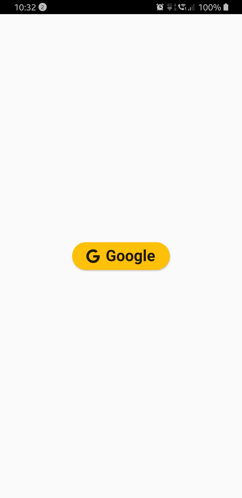
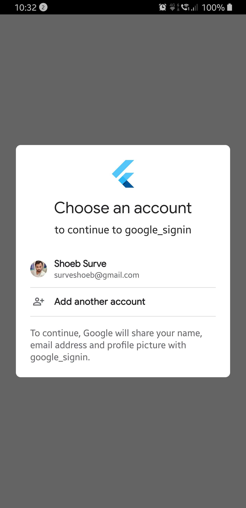

# Google SignIn

Flutter app for demonstrating Google Login.

## Getting Started

This project is just a demo on Google login using [google_sign_in.](https://pub.dev/packages/google_sign_in)

To access Google Sign-In, you'll need to make sure to register your application at [firebase console.](https://console.firebase.google.com/)

## Android integration

Firebase services (such as Google Sign-in and App Invites) require you to provide the SHA-1 of your signing certificate so we can create an OAuth2 client and API key for your app. To get your SHA-1, follow these instructions:

Open a terminal and run the keytool utility provided with Java to get the SHA-1 fingerprint of the certificate. You should get both the release and debug certificate fingerprints.

To get the release certificate fingerprint:
``keytool -exportcert -list -v -alias <your-key-name> -keystore <path-to-production-keystore>``

To get the debug certificate fingerprint:

**Mac/Linux**

``keytool -list -v -alias androiddebugkey -keystore ~/.android/debug.keystore``

**Windows**
``keytool -list -v -alias androiddebugkey -keystore %USERPROFILE%\.android\debug.keystore``

The keytool utility prompts you to enter a password for the keystore. The default password for the debug keystore is android. The keytool then prints the fingerprint to the terminal. For example:

> Certificate fingerprint: SHA1: DA:39:A3:EE:5E:6B:4B:0D:32:55:BF:EF:95:60:18:90:AF:D8:07:09

#### Generate an upload key and keystore

If you don't already have an upload key, which is useful when opting in to App signing by Google Play, you can generate one using Android Studio as follows:

1. In the menu bar, click Build > Build > Generate Signed Bundle/APK.
2. In the Generate Signed Bundle or APK dialog, select Android App Bundle or APK and click Next.
3. Below the field for Key store path, click Create new.
4. On the New Key Store window, provide the following information for your keystore and key.

5. **Keystore**
    * Key store path: Select the location where your keystore should be created.
    * Password: Create and confirm a secure password for your keystore.

6. **Key**
    * Alias: Enter an identifying name for your key.
    * Password: Create and confirm a secure password for your key. This should be different from the password you chose for your keystore.
    * Validity (years): Set the length of time in years that your key will be valid. Your key should be valid for at least 25 years, so you can sign app updates with the same key through the lifespan of your app.
    * Certificate: Enter some information about yourself for your certificate. This information is not displayed in your app, but is included in your certificate as part of the APK.

7. Once you complete the form, click OK.

## iOS integration

1. Make sure the file you download in step 1 is named GoogleService-Info.plist.

2. Move or copy GoogleService-Info.plist into the [my_project]/ios/Runner directory.

3. Open Xcode, then right-click on Runner directory and select Add Files to "Runner".

4. Select GoogleService-Info.plist from the file manager.

5. A dialog will show up and ask you to select the targets, select the Runner target.

6. Then add the CFBundleURLTypes attributes below into the [my_project]/ios/Runner/Info.plist file.

```swift
<!-- Put me in the [my_project]/ios/Runner/Info.plist file -->
<!-- Google Sign-in Section -->
<key>CFBundleURLTypes</key>
<array>
	<dict>
		<key>CFBundleTypeRole</key>
		<string>Editor</string>
		<key>CFBundleURLSchemes</key>
		<array>
			<!-- TODO Replace this value: -->
			<!-- Copied from GoogleService-Info.plist key REVERSED_CLIENT_ID -->
			<string>com.googleusercontent.apps.861823949799-vc35cprkp249096uujjn0vvnmcvjppkn</string>
		</array>
	</dict>
</array>
<!-- End of the Google Sign-in Section -->
```


For more help you can go to 
[Sign In with Google](https://pub.dev/packages/google_sign_in) or raise the issue in this repo.



